# Chat Bot no Facebook com o Wit.ai e Heroku usando o node.js
A revolução dos Chat Bots está para ficar e nós não queremos ficar para trás, pois não? :)

## Arquitetura
Basicamente qualquer mensagem enviada através do Facebook é reencaminhada para o Wit.ai e para a API (meteorologia) através do Heroku.

Os dados meteorológicos proveem de uma *3rd party API* disponibilizada pela Yahoo.


## Configurar o Wit.ai
O Wit.ai é uma plataforma para construção de chat bots que foi adquirida pelo Facebook após 18 meses da sua fundação.

1. Criar uma conta no Wit.ai em https://wit.ai

2. Criar uma nova app

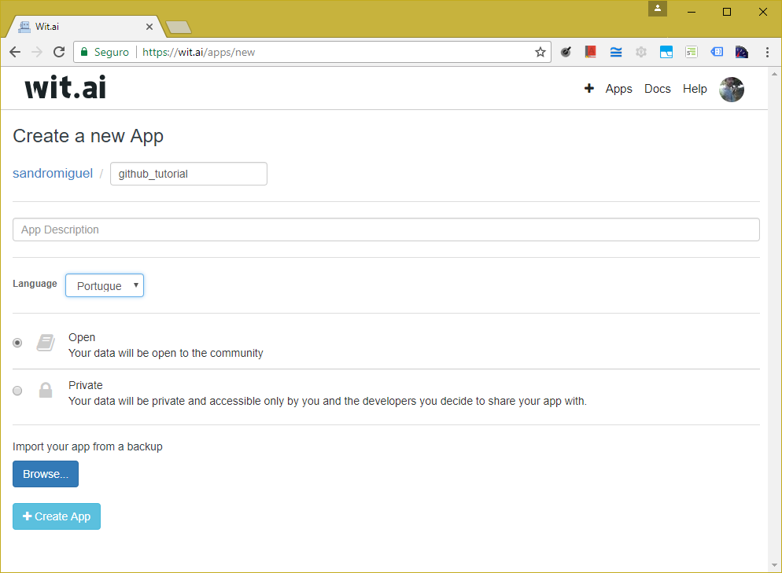

3. Criar uma história

Por enquanto vamos criar uma história de resposta rápida (sim/não)
- Entrar na página "Stories"
- Clicar no botão "Create a story"
- No campo "User says" escrever "Olá"
- No valos do "intent" colocar "greetings"
- Clicar no botão "Bot sends"
- No campo "The bot says..." escrever "Olá, gostas de falar com máquinas?"
- Clicar no botão "Set quick replies"
- No campo "Type a quick reply" escrever "Sim", pressionar a tecla "Enter", escrever "Não" e pressionar a tecla "Enter"
- Clicar no botão "Bot sends"
- Clicar em "Add new entity", escrever "yes_no" e pressionar duas vezes seguidas na tecla "Enter"
- No campo "Value" escrever "yes"
- Clicar no botão "Bot sends"
- No campo "The bot says..." escrever "Boa! Olha, em breve vou saber dizer o tempo."
- Clicar no botão "Não"
- Clicar em "Add new entity" e selecionar a opção "yes_no"
- No campo "Value" escrever "no"
- Clicar no botão "Bot sends"
- No campo "The bot says..." escrever "Ohh que pena :("
- Clicar no botão "Save Story"

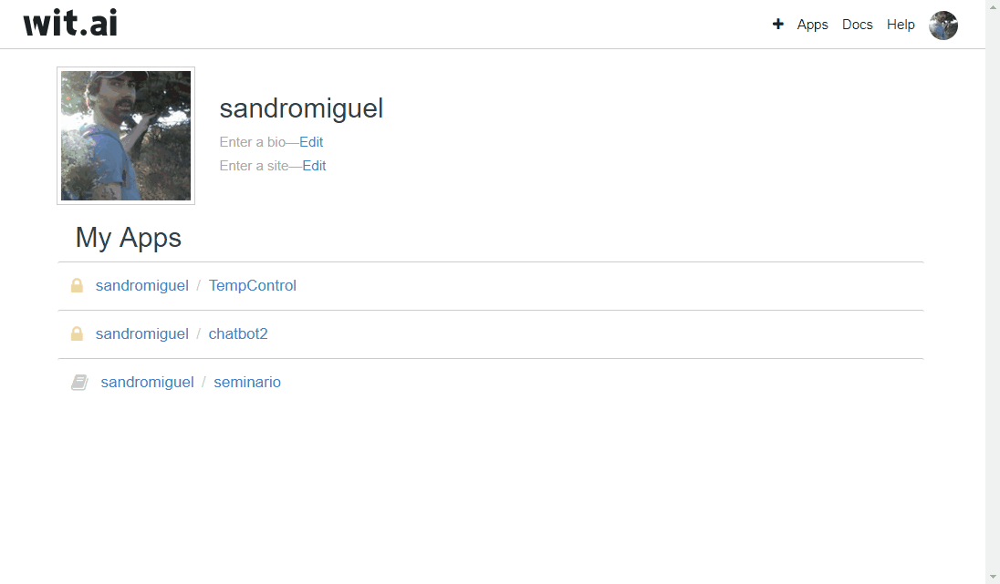

4. Localizar e guardar o "Server Access Token"
- Clicar na aba "Settings"
- Na secção "API Details" localizar o campo "Server Access Token"
- Guardar o *token* para ser usado mais tarde no Heroku

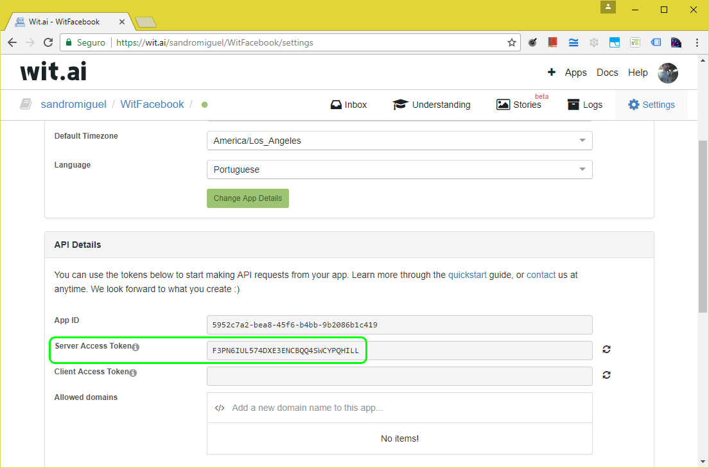

## Configurar o Heroku
O Heroku é uma (PaaS - Platform as a Service) que suporta várias linguagens de programação tendo sido adquirida pela Salesforce.com em 2010.  

1. Fazer o *clone* deste repositório para a máquina local

*NOTA #1: utilizei o Git Shell no Windows 10*

*NOTA #2: o Git Shell vem incluído no GitHub Desktop (https://desktop.github.com)*

*NOTA #3: é necessário instalar o Heroku CLI (https://devcenter.heroku.com/articles/heroku-cli#download-and-install)*

```PowerShell
git clone https://github.com/SandroMiguel/messenger-bot-witai-tutorial witai_facebook
```
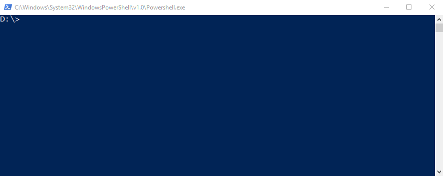

2. Entrar na pasta do projeto
```PowerShell
cd witai_facebook
```

3. Instalar as dependências
```PowerShell
npm install
```
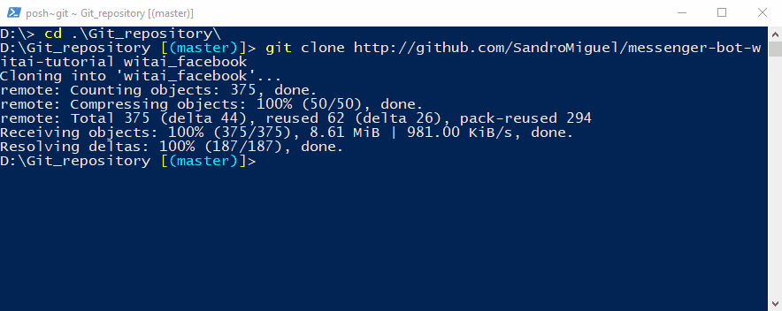

4. Criar uma conta no Heroku em https://heroku.com

5. Enviar a aplicação para o Heroku
- Efetuar o login no Heroku
```PowerShell
heroku login
```
- Criar uma aplicação no Heroku
```PowerShell
heroku apps:create chatbot-sandro
```
- Fazer o *push* do bot para o Heroku (deploy)
```PowerShell
git push heroku master
```
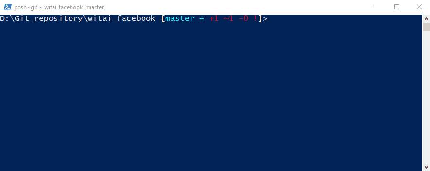

6. Definir o *token* do Wit.ai no Heroku
- O *token* fornecido anteriormente no Wit.ai deve ser configurado no Heroku

*NOTA: também é possível configurar as variáveis de ambiente no dashboard do Heroku através da página "Settings" clicando no botão "Reveal Config Vars"*
```PowerShell
heroku config:set WIT_TOKEN="F3PN6IUL574DXE3ENCBQQ4SWCYPQHILL"
```
- Abrir a aplicação no Heroku
```PowerShell
heroku open
```
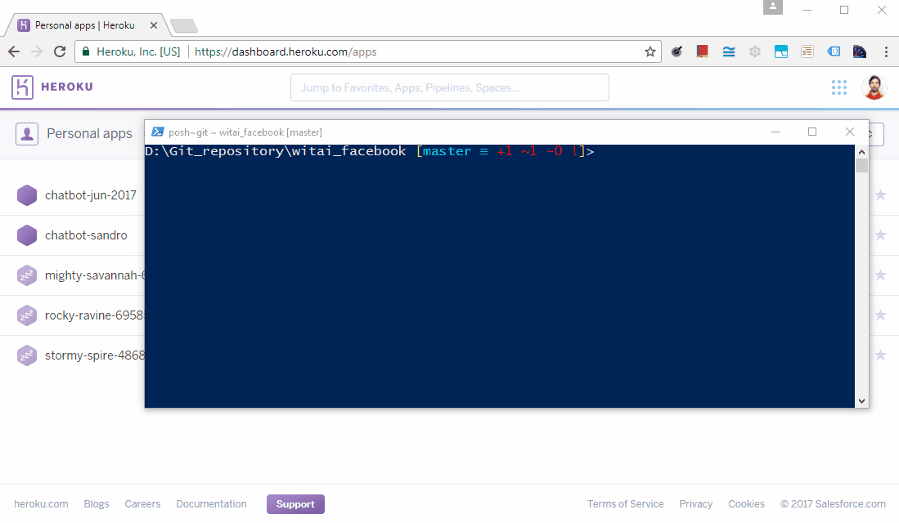

- Guardar este URL (ex.: https://chatbot-sandro.herokuapp.com/)

O Heroku já comunica com o Wit.ai !!! 

## Configurar o Facebook
Vamos configurar o Messenger do Facebook para comunicar com o chat bot.

1. Criar uma conta no Facebook Developers em https://developers.facebook.com

2. Criar uma nova página no Facebook em https://www.facebook.com/pages/create

*NOTA: Também se pode usar uma página criada anteriormente.*

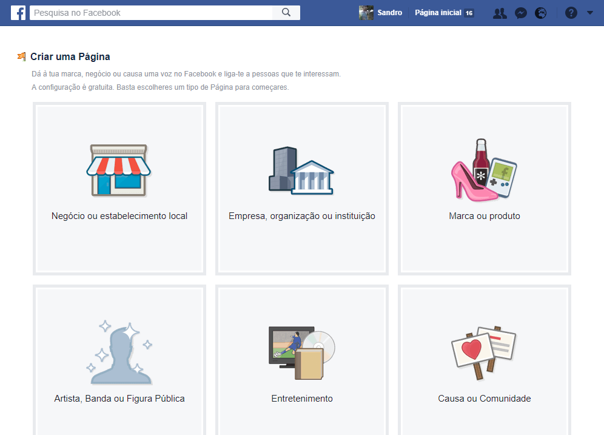

3. Criar uma nova app em https://developers.facebook.com/apps

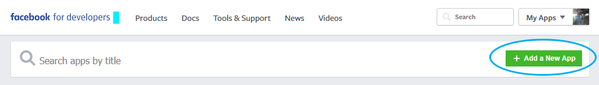

4. Configurar a app do Facebook
- Adicionar o produto "Facebook Messenger"
- Configurar o Webhooks
	- Callback URL: https://*your-heroku-app-name*.herokuapp.com/**webhooks** (não esquecer do "webhooks" no final)
	- Verify Token: just_do_it
	- Selecionar a página em "Select a page to subscribe your webhook to the page events"

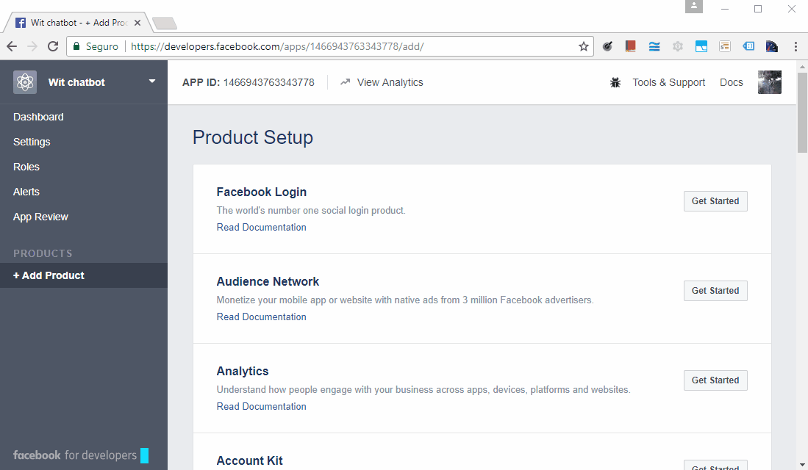

5. Gerar o *token* da aplicação do Facebook
- Clicar em "Settings"
- Selecionar a página
- Guardar o *token* para ser usado mais tarde no Heroku


- Subscrever a página na secção "Webhooks"

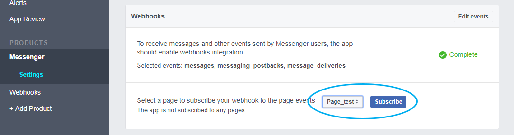

6. Definir o *token* da app do Facebook no Heroku
- O *token* fornecido anteriormente no Facebook deve ser configurado no Heroku
```PowerShell
heroku config:set FB_PAGE_TOKEN="EAAU2LXXraaIBAM2ZCd4UhC9a ... long long long token ... 9y7gSZB18pRuCgZDZD"
```

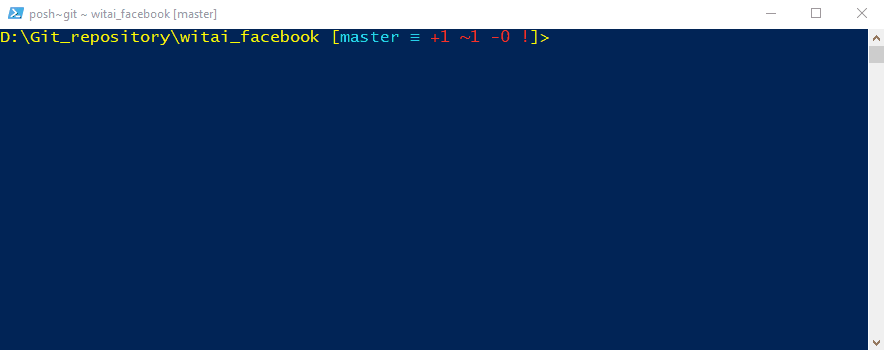

Está tudo pronto para dizer olá ao chat bot!!!

## Testar o chat bot
Caso a página do Facebook que foi criada não esteja pública, podemos adicionar um botão de conversação e testar o chat bot desta forma.

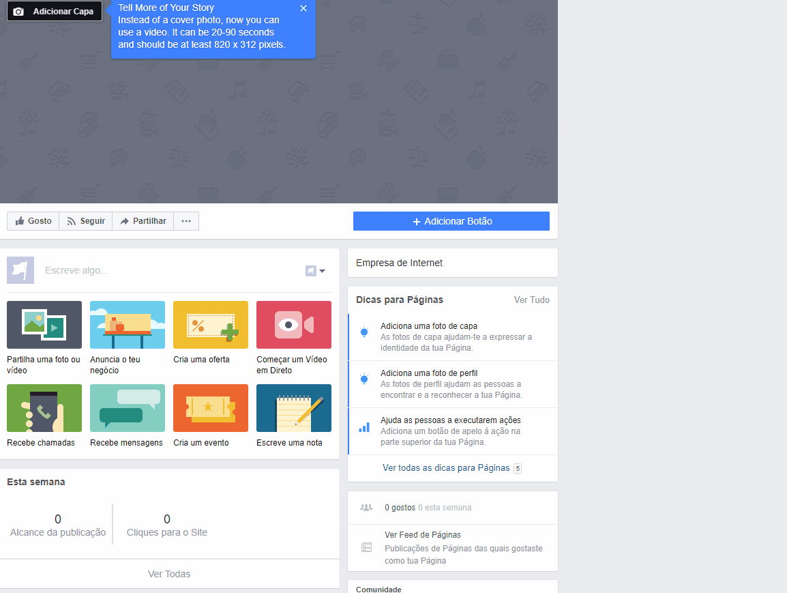

Para testar basta passar o rato por cima do botão "Enviar mensagem" e selecionar o opção "Testar botão"

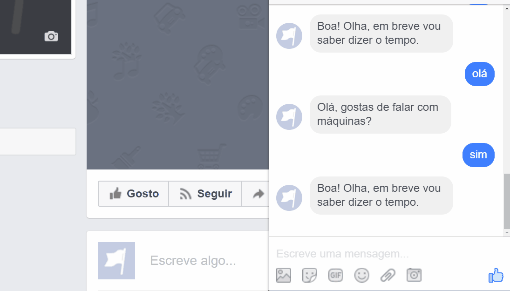

## Créditos

Este projeto é um *fork* de https://github.com/jw84/messenger-bot-witai-tutorial. Obrigado @jw84 pela inspiração.

